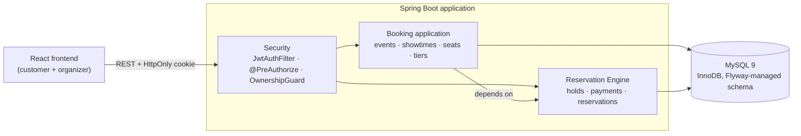
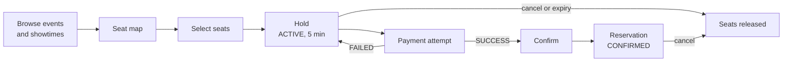
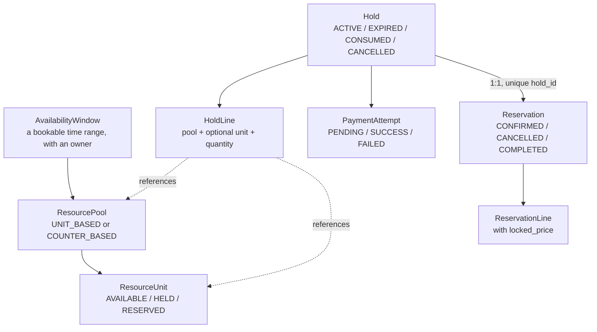
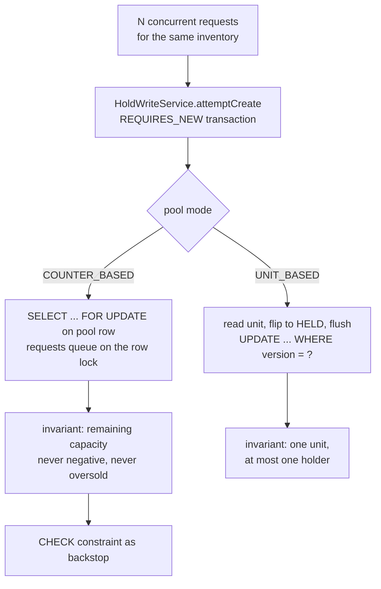
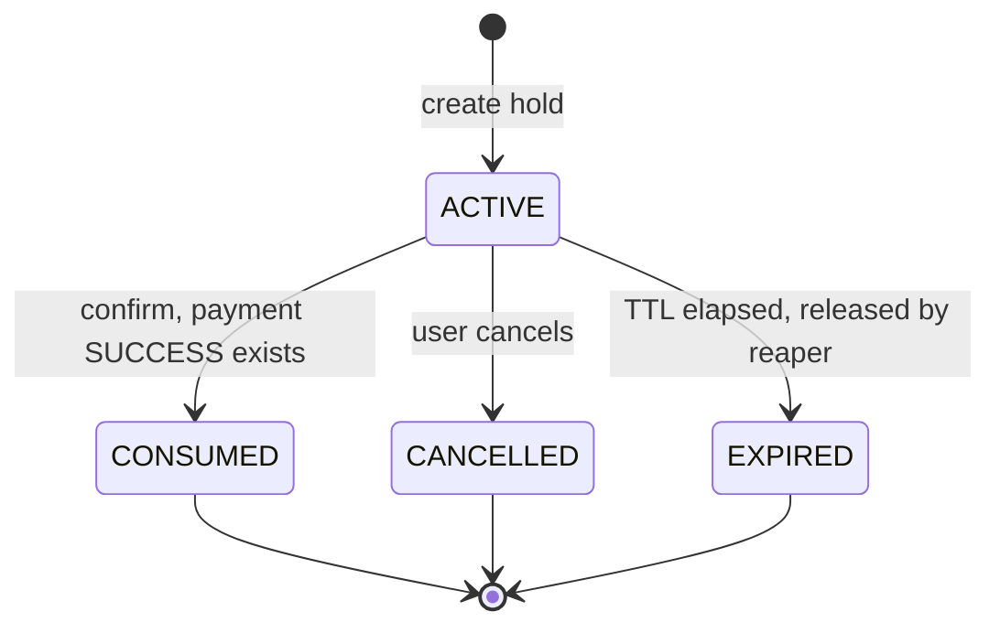
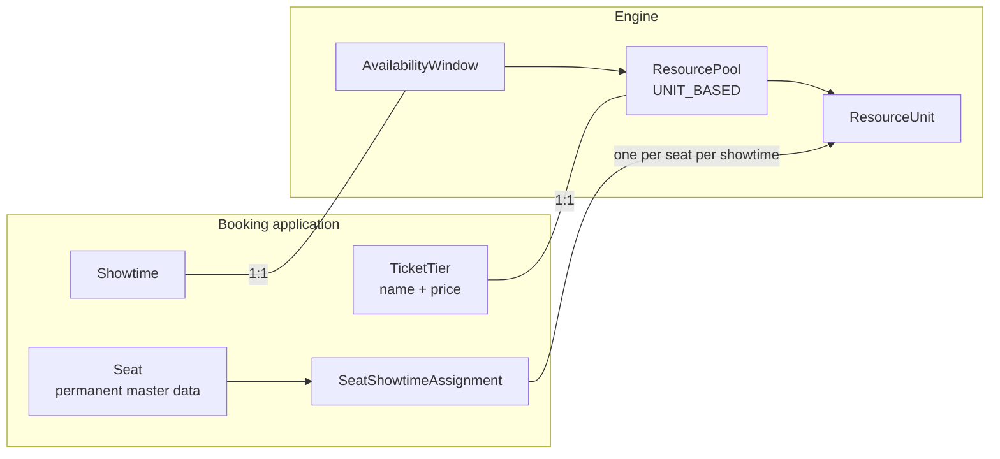

# reserv_engine

A reservation engine for scarce, contested inventory, with an event-ticket booking application built on top of it.

The question this project is built around:

> How do you safely reserve limited inventory when many users try to book the same resources at the same time?

The repository has two layers:

- **Reservation Engine** – a domain-neutral core (availability windows, resource pools, resource units, holds, payments, reservations). It knows nothing about events, venues or seats.
- **Event Booking application** – cinema-style seat booking (venues, halls, seats, events, showtimes, ticket tiers) that maps its concepts onto the engine.

A React frontend covers the customer and organizer flows. The application layer is branded EventSphere in the UI.

This is a portfolio project. Payment is a mock, there is a single application instance, and there are no performance benchmarks. Correctness under concurrency is what the code and tests focus on. See [Known limitations](#known-limitations).

---

## Contents

- [Architecture](#architecture)
- [Engine data model](#engine-data-model)
- [Concurrency control](#concurrency-control)
- [Idempotency](#idempotency)
- [Payment concurrency](#payment-concurrency)
- [Hold lifecycle](#hold-lifecycle)
- [Atomic multi-seat booking](#atomic-multi-seat-booking)
- [Unit-based vs counter-based inventory](#unit-based-vs-counter-based-inventory)
- [Mapping event booking onto the engine](#mapping-event-booking-onto-the-engine)
- [Engine / application separation](#engine--application-separation)
- [Authentication and authorization](#authentication-and-authorization)
- [Query design and lazy loading](#query-design-and-lazy-loading)
- [API overview](#api-overview)
- [Engineering test suite](#engineering-test-suite)
- [Tech stack](#tech-stack)
- [Project structure](#project-structure)
- [End-to-end demo](#end-to-end-demo)
- [Running locally](#running-locally)
- [Design decisions and tradeoffs](#design-decisions-and-tradeoffs)
- [Known limitations](#known-limitations)

---

## Architecture

A single Spring Boot application (a modular monolith, not microservices) backed by one MySQL database. The frontend talks to it over REST with an HttpOnly JWT cookie.



Dependencies point one way: Booking depends on the Engine. The Engine never imports anything from the `booking` package.

The core booking lifecycle:



---

## Engine data model

The engine's vocabulary is deliberately generic:



| Concept | Role |
|---|---|
| `AvailabilityWindow` | A time range that owns one or more pools. |
| `ResourcePool` | A group of inventory with a `pool_mode`, `total_capacity`, `remaining_capacity` and a `@Version`. |
| `ResourceUnit` | One individually identifiable reservable thing (`UNIT_BASED` pools only), with a `status` and a `@Version`. |
| `Hold` | A temporary claim on one or more resources, with a 5-minute TTL and a globally unique `idempotency_key`. |
| `HoldLine` | One claimed unit, or a quantity from a counter pool. |
| `PaymentAttempt` | One attempt to pay for a Hold. A Hold can have several attempts. |
| `Reservation` | The confirmed result. `reservation.hold_id` is unique, so a Hold converts at most once. |
| `ReservationLine` | What was reserved, with the price locked at confirmation time. |

Several rules are enforced by the schema itself, not only by application code (see `V1__baseline.sql`):

- `chk_pool_capacity_bounds`: `0 <= remaining_capacity <= total_capacity`
- `chk_unit_status`, `chk_hold_status`, `chk_pool_mode`: closed value sets
- `chk_hold_expiry_after_create`: `expires_at > created_at`
- `uq_hold_idempotency_key`, `uq_reservation_hold_id`, `uq_payment_attempt_idempotency_key`

---

## Concurrency control

### Two different kinds of "lock"

These two mechanisms have different lifetimes and different jobs.

| | Database lock / version check | Business Hold |
|---|---|---|
| Lifetime | Milliseconds, inside one transaction | 5 minutes (`HOLD_TTL` in `HoldWriteService`) |
| Protects | The critical section where inventory is read and modified | Inventory while the customer completes payment |
| Implemented by | `SELECT ... FOR UPDATE`, `@Version` checks, unique constraints | A `Hold` row with `status = ACTIVE` and `expires_at` |
| Released by | Commit or rollback | Payment and confirm, cancel, or expiry |

A database lock cannot be held while a person types card details. So the engine takes the lock only long enough to flip inventory into a `HELD` state and commit. The Hold row is what carries the claim across the next five minutes.



### Counter-based pools: pessimistic locking

For a `COUNTER_BASED` pool, `HoldWriteService.buildLine` loads the pool with `ResourcePoolRepository.findByIdForUpdate` (`@Lock(PESSIMISTIC_WRITE)`, which is `SELECT ... FOR UPDATE` on InnoDB). Concurrent requests for the same pool queue on that row lock. Inside the lock, the request checks `remaining_capacity >= quantity`, decrements it, and adds the `HoldLine`. A request that finds too little capacity throws `ResourceConflictException`, which becomes HTTP 409.

Several details matter for this to be correct:

- **The pool is not loaded as a managed entity before the locking read.** `buildLine` first asks only for the pool mode through a projection query (`findPoolModeById`). If a managed `ResourcePool` had already been loaded, the later `findByIdForUpdate` for the same id would be answered from Hibernate's identity map with a stale object instead of the freshly locked row.
- **The lock is the first thing that touches the pool row.** For counter pools it is taken before any child row referencing the pool is inserted, which avoids the lock-upgrade deadlock described below.
- **The database is the last line of defense.** Even if application logic were wrong, `chk_pool_capacity_bounds` rejects a negative remaining capacity.
- **Releases take the same lock.** Expiry, hold cancel and reservation cancel all restore capacity through `findByIdForUpdate`, so returning capacity cannot interleave with a concurrent hold.

### Unit-based pools: optimistic locking

For a `UNIT_BASED` pool (individual seats), each `ResourceUnit` has a `@Version` column and a status. `buildUnitLine` reads the unit, rejects it with 409 unless it is `AVAILABLE`, sets it to `HELD`, and calls `saveAndFlush`.

If 20 requests read the same unit as `AVAILABLE` / `version = 0` at once, only one `UPDATE ... WHERE id = ? AND version = ?` can match. The others match zero rows, Hibernate raises an optimistic-lock failure, and `GlobalExceptionHandler` maps `OptimisticLockingFailureException` to 409. The transaction rolls back.

The explicit `saveAndFlush` before the `HoldLine` insert is there on purpose. With Hibernate's default flush order (inserts before updates), every transaction first took a shared FK-check lock on the unit row via the `hold_line` insert and then tried to upgrade it to exclusive, which produced InnoDB deadlocks. Flushing the unit update first fixes the lock order. `@Version` still decides who wins.

### Why two strategies

Counter pools have one hot row that every request must modify, so queueing on a lock is the direct and simple answer. Unit pools spread contention across many rows, and most requests touch different seats, so an optimistic check avoids holding locks at all and only pays a cost when two people actually pick the same seat.

### Transaction boundaries

`HoldService.createHold` is deliberately **not** `@Transactional`. It delegates the write to `HoldWriteService.attemptCreate`, a separate bean marked `REQUIRES_NEW`:

- A separate bean, because a `@Transactional` method called on `this` bypasses Spring's proxy.
- `REQUIRES_NEW`, so a failure rolls back that transaction alone and the caller can still run a recovery read afterwards. Under the default `REQUIRED` propagation a failed insert would mark the shared transaction rollback-only and poison the recovery read.

`ReservationService` / `ReservationWriteService` use the same split for the same reason.

---

## Idempotency

Clients send an `idempotencyKey` with each hold request. `hold.idempotency_key` has a unique index (`uq_hold_idempotency_key`).

The race: two requests with the same key arrive together, both find no existing Hold, and both try to create one.

`HoldService.createHold` handles it in three steps:

1. **Fast path.** Look up the key with `findByIdempotencyKeyWithLines`. If a Hold exists, return it.
2. **Attempt.** Otherwise call `HoldWriteService.attemptCreate` (own transaction).
3. **Recover.** If the unique index rejects the insert, catch `DataIntegrityViolationException`, look the key up again, and return the winner's Hold. The loser's transaction has already rolled back, including any unit flips or capacity decrements it made.

Two things make this work:

- **The unique constraint is the arbiter.** Application-level "check then insert" is not trusted; the database decides who won.
- **The recovery read needs a fresh snapshot.** Under MySQL's default `REPEATABLE READ`, one transaction's plain reads share the snapshot taken at its first read. An earlier version wrapped the whole method in `@Transactional(readOnly = true)`. The initial pre-check was then the first read, so the recovery lookup after losing the race still saw the pre-winner snapshot, found nothing, and rethrew. Removing the wide transaction and using JOIN FETCH queries (so nothing needs a lazy session afterwards) lets each read run in its own short transaction with a fresh snapshot. The reasoning is recorded in the `HoldService` javadoc.

`IdempotencyRaceHoldConcurrencyTest` covers this: see [Engineering test suite](#engineering-test-suite).

`ReservationService.confirm` applies the same pattern keyed on `reservation.hold_id`, so confirming the same Hold twice returns the existing Reservation.

---

## Payment concurrency

The invariant, from the `PaymentAttempt` entity's contract:

> For a single Hold, at most one PaymentAttempt can reach `SUCCESS`.

`payment_attempt` only has a unique constraint on `idempotency_key`. That does nothing when concurrent requests use **different** keys, which is the case that matters. So there is no database constraint on "one SUCCESS per Hold". The invariant is enforced by serializing on the Hold row.

`PaymentAttemptService.attemptPayment` is one `@Transactional` method:

1. `holdRepository.findByIdForUpdate(holdId)` runs first, as the transaction's very first statement.
2. Then the idempotency-key lookup, the `ACTIVE` and not-expired checks, and `findByHoldIdAndStatus(holdId, SUCCESS)`.
3. Then the attempt is created and resolved.

Order matters here. In InnoDB a locking read does not itself establish the `REPEATABLE READ` snapshot; the first plain read does. By taking the row lock first, each transaction waits for the previous holder to commit. Only afterwards does its first plain read establish the snapshot, so the "is there already a SUCCESS?" check sees the previous winner's committed row.

The version of this method without the lock could land multiple SUCCESS rows for one Hold (the service comment records up to 10 in the test). `ConcurrentPaymentSuccessRaceTest` found that, and the lock fixed it.

A failed attempt leaves the Hold `ACTIVE`, so the customer can retry until the Hold expires. Confirming a Hold requires an existing SUCCESS attempt.

---

## Hold lifecycle



- **5-minute TTL.** `expires_at = created_at + 5 min`, set server-side. There is no extend or renew endpoint.
- **Server-side expiry.** Expiry is judged by `Hold.isExpired()` against the server clock. `HoldExpiryReaper` runs every 30 seconds (`@Scheduled(fixedDelay = 30_000)`), takes up to 50 expired `ACTIVE` holds, and calls `HoldExpiryService.releaseHold` for each, which releases units or restores counter capacity and marks the Hold `EXPIRED`.
- **Correctness does not depend on the reaper.** Payment and confirm both re-check `isExpired()` themselves, so an expired-but-not-yet-reaped Hold cannot be paid or confirmed. The reaper only frees inventory sooner.
- **Explicit cancel.** `POST /api/v1/holds/{id}/cancel` releases inventory immediately and sets `CANCELLED`. Cancelling an expired-but-unreaped `ACTIVE` Hold is allowed, since that frees inventory sooner.
- **Concurrent releases are safe.** `Hold` has a `@Version`. Cancel, expiry and confirm each change `status` in the same transaction as the resource changes, so whichever commits second fails its version check and rolls back, release included.
- **Reservation after payment.** Confirm requires an `ACTIVE`, unexpired Hold with a SUCCESS payment attempt. It creates the `Reservation` and its lines (locking each price), flips units to `RESERVED`, and sets the Hold to `CONSUMED`.
- **Expired and cancelled Holds cannot become reservations.** `ReservationWriteService.attemptCreate` rejects any non-`ACTIVE` or expired Hold with 409.
- **Cancelling a Reservation** moves it `CONFIRMED` to `CANCELLED` and releases its units or capacity. The originating Hold stays `CONSUMED`.

---

## Atomic multi-seat booking

A customer selecting A1, A2, A3 must end up with all three held or none. The system must not produce "A1 held, A2 held, A3 failed" behind a live Hold.

`BookingOrchestrationService.bookSeats` translates the selected seat ids into one `HoldLineRequest` per seat and makes a **single** call to `HoldService.createHold`. Inside `HoldWriteService.attemptCreate`, one `REQUIRES_NEW` transaction loops over all lines. If any line throws (unit not available, insufficient capacity, a lost optimistic-lock race), the exception propagates out of the transaction and Spring rolls back everything it did: earlier units flipped to `HELD`, pool decrements, and the Hold itself. Only when every line succeeds does the transaction commit a Hold with all its lines.

The same all-or-nothing rule applies at confirm time, where all reservation lines are created in one transaction.

---

## Unit-based vs counter-based inventory

| | Unit-based | Counter-based |
|---|---|---|
| What is reserved | A specific `ResourceUnit` | A quantity from `remaining_capacity` |
| Identity | Each unit has its own id and status | Only the count matters |
| Fits | Numbered seats, rooms, parking bays | General admission, capacity pools |
| Concurrency | Optimistic: `@Version` on the unit | Pessimistic: `FOR UPDATE` on the pool row |
| `HoldLine` | `resource_unit_id` set, quantity 1 | `resource_unit_id` null, `quantity` set |

The engine supports both so that one model does not need to fake the other (a general-admission pool as thousands of unit rows, or seats as a counter that cannot say *which* seat).

The Event Booking application uses only `UNIT_BASED` pools, since seats are discrete (`TicketTierService` creates every tier as `UNIT_BASED`). Counter-based behavior is implemented in the engine and exercised directly by the concurrency tests.

---

## Mapping event booking onto the engine



| Booking concept | Engine concept |
|---|---|
| Showtime | `AvailabilityWindow` (1:1, `uq_showtime_availability_window`) |
| Ticket tier | `ResourcePool` (1:1, `uq_ticket_tier_resource_pool`), always `UNIT_BASED` |
| A seat for one showtime | `ResourceUnit`, linked through `SeatShowtimeAssignment` |

**Physical seat vs. resource unit.** A `Seat` (for example A1 in Screen 1) is permanent master data: it exists once per hall, with `uq_seat_hall_label`, and never changes state. It is never itself `HELD` or `RESERVED`. For each showtime, a new `ResourceUnit` is created for the seats offered, and a `SeatShowtimeAssignment` row links the seat to that showtime's unit (`uq_assignment_seat_showtime`, `uq_assignment_resource_unit`). A1 at 7 pm and A1 at 10 pm are two different units and can be booked independently.

A seat's tier is derived through the unit's pool (`resource_unit` to `resource_pool` to `ticket_tiers`). It is not a fixed column on the seat, so the same physical seat can sit in different tiers for different showtimes.

The seat map is one join-driven query: every seat in the hall is `LEFT JOIN`ed to its assignment for the requested showtime. A seat with no assignment has a `null` status ("not on sale for this showtime"). Otherwise the status comes straight from the `ResourceUnit`.

---

## Engine / application separation

- Booking depends on the Engine: `SeatShowtimeAssignment` holds a foreign key to `resource_unit`, `TicketTier` holds one to `resource_pool`, `Showtime` holds one to `availability_window`, and the booking services call `HoldService`, `ResourcePoolService` and `AvailabilityWindowService`.
- The Engine has no imports from `com.reserv_engine.booking` and no references to `Event`, `Venue`, `Hall`, `Seat` or `Showtime`. Its only link to the application is by ID (`holder_id`, `owner_id`) and by the generic pool, unit and window concepts. Engine controllers use `SecurityUtils` for the current user id, but no Engine service or entity depends on security or on the `User` entity.
- A query that joins across both worlds lives in the Booking layer. The customer-facing "My Reservations" query joins reservations to seat assignments, events and tiers, so it sits in `SeatShowtimeAssignmentRepository` and not in the Engine's `ReservationRepository`.

Because the engine's vocabulary is time window, pool, unit, hold, payment and reservation, other domains that need scarce, time-bounded, hold-then-pay inventory fit the same model: for example hotel rooms as units, parking bays as units, or conference capacity as a counter pool. Only the Event Booking mapping is implemented here.

The boundary is a package and dependency-direction convention within one Maven module, not a separate artifact. It is not compiler-enforced.

---

## Authentication and authorization

**Authentication**

- Login (`POST /auth/login`) verifies credentials through Spring's `AuthenticationManager` (BCrypt password hashes) and issues a JWT signed with an HMAC key (jjwt 0.12.6). Subject is the user id; the roles are embedded as a claim.
- The token is sent as an **HttpOnly cookie** named `jwt`, so page JavaScript cannot read it. `Secure` and `SameSite` come from `app.cookie.secure` (default `false`) and `app.cookie.same-site` (default `Lax`). Lifetime follows `jwt.expiration-minutes` (default 60). `POST /auth/logout` clears the cookie.
- Spring Security runs **stateless** (`SessionCreationPolicy.STATELESS`). `JwtAuthFilter` reads the cookie, validates the token, and populates the security context. CSRF protection is disabled, so cross-site protection relies on `SameSite`.
- Roles are read from the token, so a role change takes effect only after the user logs in again.

**Authorization**

- Roles: `CUSTOMER`, `ORGANIZER`, `PLATFORM_ADMIN` (the last exists in the enum but no endpoint currently requires it). Signup grants `CUSTOMER`.
- Endpoint access uses `@PreAuthorize`: for example creating holds requires `CUSTOMER`; creating showtimes, tiers and seat assignments and publishing require `ORGANIZER`.
- **Ownership is checked on the backend.**
  - The customer identity on a hold comes from the JWT, never from the request body: `HoldController` rebuilds the request with `holderId = SecurityUtils.currentUserId()`.
  - `OwnershipGuard` verifies that the caller owns the Hold or Reservation before payment, confirm and cancel.
  - Organizer operations compare the caller with the event's organizer or the venue's manager (for example `EventPublishService`, `ShowtimeService`, `TicketTierService`, `SeatShowtimeAssignmentService`).
  - The seat map for an unpublished event is visible only to the owning organizer; a non-owner gets a 404.
- The frontend hides pages by role for usability. That is not the security boundary: every rule above is enforced server-side regardless of what the UI shows.

Two caveats are stated under [Known limitations](#known-limitations): roles are self-assignable for demo purposes, and the dev JWT secret is committed.

---

## Query design and lazy loading

`spring.jpa.open-in-view=false`, and all `@ManyToOne` / `@OneToMany` associations are `LAZY`. So nothing can quietly lazy-load during response serialization, and any code that reads an association outside a transaction fails loudly with `LazyInitializationException`.

The fix used for those cases is a **targeted `JOIN FETCH`**, not a blanket `@Transactional`:

- **Why not just add `@Transactional`?** The transaction boundaries here are deliberate. Widening `HoldService.createHold` into one transaction was the cause of the idempotency-recovery bug described above (a single `REPEATABLE READ` snapshot hiding the winner's commit). Adding `@Transactional` to make a lazy access work would have reintroduced it.
- **What is done instead.** Queries that feed a response fetch exactly the graph they need: `HoldRepository.findByIdempotencyKeyWithLines` (hold, lines, pool, unit), `ReservationRepository.findByHoldIdWithLines`, `findByIdWithLines`, and `SeatShowtimeAssignmentRepository.findBySeatIdAndShowtimeIdWithResourceUnitAndPool` (assignment, unit, pool, seat) for booking. The result is fully initialized, so no session has to stay open and each read can be its own short transaction.

Read-model choices:

- **Projection interfaces** (`SeatMapRow`, `MyReservationRow`, `EventBrowseRow`, `ShowtimeBrowseRow`, `PoolAvailableCount`) return flat rows with no entity references, so customer-facing screens can't trigger lazy loads.
- **Join-driven customer queries.** The seat map and "My Reservations" are single queries that join across seats, assignments, units, tiers, events and reservation lines, and the service groups rows into one card per reservation.
- **Aggregates by subquery.** Event and venue summaries (`showtimeCount`, `startingPrice`) use correlated subqueries instead of joins, because joining showtimes and tiers directly would multiply rows per event.
- **No N+1 on paged reservations.** `ReservationService.findMyReservations` pages the reservation ids first, then loads their lines in one `findAllByIdInWithLines` `IN (...)` query.

Customer-facing endpoints return purpose-built response DTOs (for example `BookingHoldResponse` with seat labels, tier names and prices; `MyReservationResponse`), not persistence entities or raw engine ids.

---

## API overview

Not exhaustive. Everything except `/auth/*` requires authentication.

| Area | Endpoints |
|---|---|
| Auth | `POST /auth/signup` · `POST /auth/login` · `POST /auth/logout` · `GET /users/me` · `POST /users/me/roles` |
| Organizer setup | `POST /api/v1/events/{eventId}/showtimes` · `POST /api/v1/showtimes/{id}/ticket-tiers` · `POST /api/v1/ticket-tiers/{id}/seat-assignments` · `PATCH /api/v1/events/{id}/publish` · `GET /api/v1/events/mine` |
| Customer browse | `GET /api/v1/events` · `GET /api/v1/events/{id}` · `GET /api/v1/events/{id}/showtimes` · `GET /api/v1/showtimes/{id}/seat-map` |
| Booking | `POST /api/v1/showtimes/{id}/bookings` (seat ids + idempotency key) · `POST /api/v1/payment-attempts` · `POST /api/v1/reservations/confirm` |
| After booking | `GET /api/v1/my-reservations` · `POST /api/v1/holds/{id}/cancel` · `POST /api/v1/reservations/{id}/cancel` |

The Engine's own low-level endpoints (`POST /api/v1/holds`, `/api/v1/availability-windows`, pools) are also exposed. The booking flow does not need them: `POST .../bookings` hides the Hold behind seat ids.

---

## Engineering test suite

The concurrency tests all extend `AbstractIntegrationTest`: a real **MySQL 9.4.0** in Testcontainers (no H2), a real embedded server on a random port (`RANDOM_PORT`, real HTTP), Flyway running the real migration, and real cookie authentication. Threads are released together with a two-latch pattern (`ExecutorService` + `CountDownLatch`). Assertions check both the HTTP outcomes and the resulting database rows, since status codes alone can hide overselling.

The numbers below are the values the tests assert, not benchmarks.

### 1. `CounterBasedHoldConcurrencyTest`: no overselling on a counter pool
- **Race:** 20 concurrent hold requests, pool capacity 5.
- **Guarantee:** exactly capacity-many succeed, the rest are rejected cleanly.
- **Mechanism:** `SELECT ... FOR UPDATE` on the pool row, capacity check inside the lock.
- **Proves:** 5 × 201, 15 × 409, 0 server errors, and final `remaining_capacity = 0`.

### 2. `UnitBasedHoldConcurrencyTest`: one seat, one holder
- **Race:** 20 concurrent hold requests on the same single `AVAILABLE` unit.
- **Guarantee:** exactly one hold wins.
- **Mechanism:** `@Version` on `ResourceUnit`; the losing `UPDATE ... WHERE version = ?` matches zero rows.
- **Proves:** 1 × 201, 19 × 409, 0 server errors, unit ends `HELD` at `version = 1`.

### 3. `IdempotencyRaceHoldConcurrencyTest`: duplicate requests converge
- **Race:** 20 concurrent requests sharing one idempotency key, on a pool of 100.
- **Guarantee:** one logical Hold, and every caller gets it.
- **Mechanism:** `uq_hold_idempotency_key`, `REQUIRES_NEW` write, recovery lookup after a lost insert.
- **Proves:** 20 × 201, all carrying the same hold id, exactly 1 row in `hold` for the key, and `remaining_capacity = 99`, so capacity was decremented once, not per request. It also runs through the real cookie-auth and ownership layer.

### 4. `ConcurrentPaymentSuccessRaceTest`: one SUCCESS per Hold
- **Race:** 5 iterations, each with 20 concurrent payment attempts (`simulateSuccess = true`, a different idempotency key per request) against one `ACTIVE` Hold.
- **Guarantee:** at most one attempt reaches `SUCCESS`.
- **Mechanism:** `Hold` row lock taken as the first statement, then the SUCCESS check (see [Payment concurrency](#payment-concurrency)).
- **Proves:** every iteration ends with exactly one `SUCCESS` row (the test fails on 0 or on more than 1), and no unexpected status codes. This test found and drove the fix for a real bug: before the lock, multiple SUCCESS rows could land.

### 5. `ConfirmVsCancelRaceTest`: confirm and cancel cannot both win
- **Race:** 30 iterations of confirm racing cancel on the same Hold. Confirm is structurally slower, so the test measures each path's solo latency and derives a head start; otherwise cancel wins every time and half the scenario is never exercised.
- **Guarantee:** exactly one wins, and state is consistent either way.
- **Mechanism:** `Hold.@Version` plus status checks in the same transaction as the resource changes.
- **Proves:** every iteration resolves to one winner with consistent state (confirm won: `CONSUMED` + one Reservation; cancel won: `CANCELLED` + no Reservation + capacity restored), and both branches actually occurred.

### 6. `ConfirmVsExpiryTest`: an expired Hold can never be confirmed
- **Race:** 10 iterations × 10 concurrent confirms against an already-expired Hold, while `HoldExpiryService.releaseHold` runs at the same time.
- **Guarantee:** confirming an expired Hold always fails, regardless of when the reaper runs.
- **Mechanism:** `confirm`'s own `isExpired()` re-check, independent of the reaper.
- **Proves:** all confirms get 409, the Hold ends `EXPIRED`, 0 reservations exist, and capacity is restored. Not a fair race with two valid outcomes, but a defensive check holding under load.

### 7. `ExpiryVsExpiryRaceTest`: the reaper's retries are safe
- **Race:** 20 iterations, two concurrent `releaseHold` calls on the same expired Hold (the reaper is written to "retry next run", so overlap is realistic).
- **Guarantee:** resources are released exactly once, never twice and never zero times.
- **Mechanism:** `Hold.@Version`; the second commit fails its version check and rolls back its release.
- **Proves:** exactly one clean winner in 20/20 iterations, final capacity equal to total (no double release).

### 8. `HoldCancelRaceTest`: double-cancel on holds (counter and unit)
- **Race:** 20 iterations each for two concurrent cancels of the same `ACTIVE` Hold, once with a counter pool and once with a unit pool.
- **Guarantee:** one 200, one 409, released once.
- **Mechanism:** counter path: pool lock, then `Hold.@Version` at commit; unit path: `Hold.@Version` alone. Two different routes to the same guarantee, so both are tested.
- **Proves:** exactly one OK and one CONFLICT in every iteration, Hold `CANCELLED`, capacity or unit released exactly once.

### 9. `ReservationCancelRaceTest`: double-cancel on reservations
- **Race:** the same shape as test 8, applied to a `CONFIRMED` Reservation, 20 iterations for each of counter and unit.
- **Guarantee:** exactly one cancel wins and the release happens once. Cancelling a Reservation does not touch its originating Hold, which is seeded `CONSUMED`.
- **Mechanism:** `Reservation.@Version` plus the pool lock on the counter path.
- **Proves:** exactly one OK and one CONFLICT in every iteration, with capacity or the unit released exactly once (no double release).

### 10. `DuplicateConfirmDiscoveryTest` and `UnitBasedDuplicateConfirmDiscoveryTest`: duplicate confirms
- **Race:** 20 identical concurrent confirm requests for one Hold, on a counter pool and on a unit pool.
- **Guarantee:** at most one Reservation is ever created. On the unit path, the unit goes `HELD` to `RESERVED` exactly once (`version = 1`).
- **Mechanism:** `uq_reservation_hold_id`, `REQUIRES_NEW` write, and a recovery re-query.
- **Why "discovery":** the tests were written to observe real behavior first. Under 20 concurrent confirms, the first version of `confirm` returned raw 500s to about 9 of 20 callers (recorded in the `ReservationService` javadoc). The causes were duplicate-key rejections, InnoDB deadlocks between colliding unique-index inserts (surfacing as `CannotAcquireLockException`), and a timing-dependent `ResourceConflictException`. Each was fixed by splitting the write into `ReservationWriteService` and widening the recovery catch.
- **What is asserted:** at most one reservation row (and, for units, `version = 1` and `RESERVED`). Status-code distribution is printed, not asserted. On the unit-based path, `confirm` does not catch `OptimisticLockingFailureException`, so some losers can still receive 409 rather than the recovered 201.

Also in the repository: `UserServiceTest` (default role assignment, password hashing, duplicate email) and a context-load test.

---

## Tech stack

Verified against `pom.xml`, `application.properties`, `compose.yaml` and `frontend/package.json`.

| Layer | Technology |
|---|---|
| Language / runtime | Java 21 |
| Framework | Spring Boot 4.1.0 (Web MVC, Validation) |
| Persistence | Spring Data JPA / Hibernate, MySQL (`mysql-connector-j`) |
| Migrations | Flyway (`spring-boot-starter-flyway`, `flyway-mysql`), `ddl-auto=validate` |
| Security | Spring Security, JWT via jjwt 0.12.6, BCrypt |
| Build | Maven (wrapper included) |
| Testing | JUnit 5, Spring Boot Test, Testcontainers (MySQL 9.4.0), AssertJ |
| Frontend | React 19, TypeScript, Vite, react-router-dom 7, plain CSS |
| Dev database | MySQL via Docker Compose (`compose.yaml`) |

Not part of this project: Redis, Kafka or any message broker, caching layer, WebSockets, microservices split.

---

## Project structure

```text
.
├── compose.yaml                        # dev MySQL container
├── pom.xml
├── src/main/java/com/reserv_engine/
│   ├── controller/                     # Engine REST + /auth + /users
│   ├── service/                        # Engine: HoldService, HoldWriteService,
│   │                                   #   PaymentAttemptService, ReservationService,
│   │                                   #   ReservationWriteService, Hold*/Reservation* cancel + expiry
│   ├── repository/                     # Engine repositories (findByIdForUpdate, JOIN FETCH queries)
│   ├── entity/                         # Engine JPA entities + User
│   ├── core/domain/                    # enums: HoldStatus, PoolMode, ResourceUnitStatus, ...
│   ├── dto/                            # Engine request/response DTOs
│   ├── scheduler/                      # HoldExpiryReaper
│   ├── exception/                      # GlobalExceptionHandler
│   ├── security/                       # JwtService, JwtAuthFilter, OwnershipGuard, SecurityUtils
│   ├── config/                         # SecurityConfig (CORS, filter chain), CookieProperties
│   └── booking/                        # Event Booking application (depends on the Engine)
│       ├── controller/  service/  repository/  entity/  dto/  types/
├── src/main/resources/
│   ├── application.properties
│   └── db/migration/V1__baseline.sql   # full schema
├── src/test/java/com/reserv_engine/    # concurrency + integration tests (Testcontainers)
└── frontend/                           # React + TypeScript + Vite
    └── src/{api,components,context,pages/{customer,organizer},styles,utils}
```

---

## End-to-end demo

Venues, halls and physical seats are treated as demo infrastructure: created once, not part of the booking flow. The repository does not ship a seed script; they can be created through the organizer endpoints or inserted directly. Everything after that is dynamic booking behavior.

1. **Setup (organizer).** Sign up, then grant yourself the `ORGANIZER` role and log in again to get a token that carries it. Have a venue, hall with seats, and an event available.
2. **Configure a showtime.** Pick an event, hall and time window. This creates the showtime and its engine `AvailabilityWindow`.
3. **Ticket tiers.** Add tiers (name, price, capacity). Each creates a `UNIT_BASED` `ResourcePool` with one `ResourceUnit` per unit of capacity.
4. **Seat assignment.** Assign physical seats to each tier. The number of seats must exactly match the tier's available units, or the request is rejected. Each assignment links a seat to that showtime's unit.
5. **Publish.** The event moves from `DRAFT` to `PUBLISHED` and appears in customer browsing.
6. **Customer browses.** Events, showtimes, then the **seat map**, coloured by real unit status (available / held or reserved / not on sale).
7. **Hold.** Selecting seats calls `POST /showtimes/{id}/bookings`. All seats are held atomically for 5 minutes, and the response lists the lines and total price.
8. **Payment.** The checkout page shows the countdown and submits a mock payment attempt (simulate success or failure).
9. **Reservation.** Confirm converts the Hold into a `Reservation` with prices locked per line.
10. **My Reservations.** An enriched view with event title, showtime, seat labels, tiers and prices.
11. **Cancellation.** Cancel a `CONFIRMED` reservation, and its seats return to `AVAILABLE`. A customer can also cancel a still-`ACTIVE` hold from checkout.

If a second customer selects seats that another customer just held, the API answers 409 and the seat map refreshes.

---

## Running locally

**Prerequisites**

- Java 21
- Docker (for the dev MySQL container, and required by the Testcontainers-based tests)
- Node.js (a version supported by Vite 8) and npm for the frontend

**Database**

`compose.yaml` defines a `mysql:latest` container (`reserveengine-dev-db`) on port 3306 with root password `root` and database `reserve_engine`. Its `volumes` entry mounts an absolute host path from the author's machine. Edit or remove that line before using it. `spring-boot-docker-compose` is on the runtime classpath, so `./mvnw spring-boot:run` will bring the container up for you.

```bash
docker compose up -d        # or let spring-boot:run start it
```

Flyway applies `V1__baseline.sql` on startup and Hibernate validates the schema (`ddl-auto=validate`).

**Configuration** (`application.properties`)

| Property | Default | Notes |
|---|---|---|
| `DATABASE_HOST` / `DATABASE_PORT` / `DATABASE_NAME` | `localhost` / `3306` / `reserve_engine` | Environment variables used in the JDBC URL |
| `spring.datasource.username` / `password` | `root` / `root` | Set in the properties file |
| `jwt.secret` | committed dev value | Override for anything beyond local use |
| `jwt.expiration-minutes` | `60` | JWT and cookie lifetime |
| `app.cookie.secure` / `app.cookie.same-site` | `false` / `Lax` | Set `secure=true` behind HTTPS |

**Backend** (port 8080 by default)

```bash
./mvnw spring-boot:run
```

**Frontend**

```bash
cd frontend
npm install
npm run dev        # http://localhost:5173
```

The backend's CORS configuration allows only `http://localhost:5173`, and the frontend's API base URL is set to `http://localhost:8080` in `frontend/src/api/client.ts`.

**Tests** (Docker must be running; each test class starts a MySQL 9.4.0 container)

```bash
./mvnw test
./mvnw test -Dtest=ConcurrentPaymentSuccessRaceTest     # a single class
```

---

## Design decisions and tradeoffs

- **Hold before Reservation.** Payment takes human time; database locks cannot span it. A Hold claims inventory for a bounded window and is cheap to release, so a Reservation exists only once money has actually been accepted.
- **Physical Seat is separate from ResourceUnit.** Seats are permanent master data; availability is per-occurrence. Merging them would force either state on the physical seat or rewriting seat rows per showtime.
- **A generic engine.** The engine's rules (no overselling, all-or-nothing holds, at-most-one payment success, idempotent creation) do not depend on movies. Keeping domain concepts out of it lets those rules be tested once, in isolation, and lets the booking app be thin.
- **Pessimistic where contention is concentrated, optimistic where it is spread.** A counter pool is a single hot row, so a row lock is the direct fit. Seats are many rows with rare collisions, so `@Version` costs nothing until two people pick the same seat.
- **Idempotency enforced at the database boundary.** A unique index decides the winner of a race; application checks are only a fast path. The same idea guards reservations (`uq_reservation_hold_id`).
- **Short, explicit transactions over one big one.** `REQUIRES_NEW` write beans and non-transactional orchestration keep each critical section small and keep recovery reads on fresh snapshots. The cost is more classes (`XService` / `XWriteService`) and having to reason about propagation.
- **Targeted `JOIN FETCH` over widening transactions.** Fetch exactly what a response needs, and leave transaction boundaries alone (see [Query design](#query-design-and-lazy-loading)).
- **No Redis, Kafka or cache.** Correctness lives in one MySQL row per contested resource. There is no measured bottleneck here that a cache or broker would fix, and adding either would add another place for inventory state to disagree with the database.
- **Polling reaper, not per-hold timers.** A 30-second `@Scheduled` sweep is simple and restart-safe (state is in the database). Because expiry is also re-checked at payment and confirm time, the sweep interval only affects how quickly inventory becomes visible again. Running several instances would run several reapers, which is redundant but safe (`ExpiryVsExpiryRaceTest`).

---

## Known limitations

- **Payment is a mock.** `POST /api/v1/payment-attempts` takes a client-supplied `simulateSuccess` flag. No gateway is integrated.
- **"One SUCCESS per Hold" is enforced by a row lock and an application check**, not by a database constraint.
- **Roles are self-assignable.** `POST /users/me/roles` lets any authenticated user grant themselves any role (including `PLATFORM_ADMIN`). This makes the demo flow work; it is not an authorization design.
- **Dev secrets are committed.** `jwt.secret` and the database credentials are in `application.properties`. Cookies default to `Secure=false`, and CSRF protection is disabled (mitigated only by `SameSite`).
- **Idempotency keys are globally unique.** They are not scoped to a user.
- **Multi-seat all-or-nothing is by design and by transaction semantics.** There is no dedicated test that injects a failure on the Nth seat and asserts a full rollback.
- **No server-side showtime time validation.** The backend accepts any start/end pair the schema allows (`end > start`); past-time and overlap checks are done only in the frontend.
- **Single instance, no benchmarks.** Nothing here has been load-tested or run in production.
- **Duplicate confirm on unit-based pools** can still return 409 to some losers (see test 10). The safety invariant holds; the idempotent-201 behavior is stronger on the counter path.
